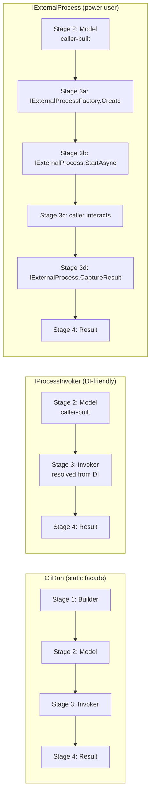
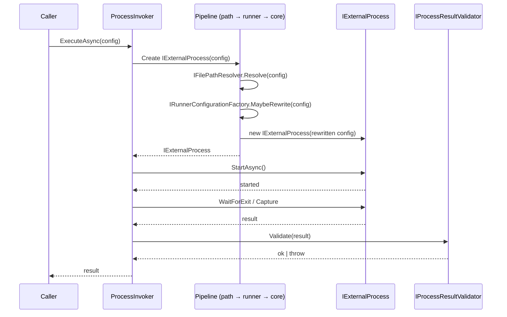

# Architecture

This guide explains how CliInvoke works internally. It walks through the
data-flow that every invocation follows, shows how the three invocation
patterns (`CliRun`, `IProcessInvoker`, `IExternalProcess`) enter and exit
that data-flow, and describes the **Process Invocation Pipeline** — the
layered pattern CliInvoke uses to keep cross-cutting concerns (path
resolution, runner wrapping, result validation) out of the core execution
path.

If you only read one section, read
[The data-flow](#the-data-flow-builder--model--invoker--result) and
[The Process Invocation Pipeline](#the-process-invocation-pipeline).

## Goals

This page exists to answer four questions precisely:

1. What does an invocation look like end-to-end, from the moment a caller
   decides to run a command to the moment the caller receives a result?
2. Which types are involved at each stage, and what are the boundaries
   between them?
3. How do the three invocation patterns map onto that data-flow?
4. Where does custom logic (path resolution, result validation, runner
   wrapping) plug in?

## Terminology

The following terms are used throughout this guide. They mirror the
canonical definitions in
[`GLOSSARY.md`](https://github.com/alastairlundy/CliInvoke/blob/main/GLOSSARY.md#core-concepts).

A **Builder** is a fluent, mutable object used to assemble a configuration
model. Each builder is a short-lived staging area whose only job is to
produce exactly one model via `Build()`. The produced model is independent
of the builder — they do not share lifetime. Examples:
`ProcessConfigurationBuilder`, `ArgumentsSpec`, `EnvironmentVariablesSpec`,
`UserCredentialSpec`.

A **Configuration Model** is an immutable, value-bearing object that
describes one aspect of how a process should be run. Models in this
library are POCOs: they hold data, expose read-only properties, and
implement value equality. Examples: `ProcessConfiguration`,
`ProcessExitConfiguration`, `UserCredential`, `ProcessTimeoutPolicy`,
`ProcessResourcePolicy`.

An **Invoker** is the abstraction that turns a configuration model into a
running process. The default implementation, `ProcessInvoker`, wires
together configuration, exit behaviour, cancellation, and piping, and
returns a `ProcessResult`. The invoker owns nothing about the
configuration; it reads the model, runs the process, and disposes the
OS resources it allocated.

A **Result** is the immutable object returned by the invoker after the
process exits. Three concrete result types exist —
`ProcessResult`, `BufferedProcessResult`, and `PipedProcessResult` —
corresponding to the three execution modes (Basic, Buffered, Piped).
Results are the canonical return value of the pipeline.

A **Process Invocation Pipeline** is the layered interceptor pattern that
CliInvoke uses to execute cross-cutting concerns around the core process
orchestration. The pipeline wraps `IExternalProcess` and lets each
cross-cutting concern modify the configuration before execution or the
result after execution.

A **Process Invocation Context** is the conceptual state-bearing object
that moves through the pipeline. It encapsulates the requested
configuration, the execution mode (Basic, Buffered, or Piped), the
runner configuration (if any), and the resulting process output. Each
cross-cutting concern reads from and writes to the context, and the
context is the single source of truth that travels from the start of
the pipeline to the end.

A **Resource-Owning Type** is any CliInvoke type that holds, directly or
transitively, an unmanaged resource (pipes, file handles, process
threads) or a sensitive managed resource (`SecureString`). The library
exposes exactly five; see the
[Resource Disposal guide](resource-disposal.md) for the full list.

## The data-flow: Builder → Model → Invoker → Result

Every CliInvoke invocation moves through four stages, regardless of which
pattern the caller uses.

```text
   ┌────────────┐   Build()   ┌──────────────────┐  ExecuteAsync   ┌──────────┐
   │  Builder   │ ──────────► │  Configuration   │ ──────────────► │ Invoker  │
   │ (mutable)  │             │      Model       │                 │ (executes)│
   └────────────┘             │   (immutable)    │                 └────┬─────┘
                              └──────────────────┘                      │
                                                                        ▼
                              ┌──────────────────┐   await    ┌──────────────────┐
                              │ Process Result   │ ◄────────── │   Pipeline +     │
                              │   (immutable)    │             │   IExternalProcess│
                              └──────────────────┘             └──────────────────┘
```

```mermaid
flowchart LR
    A[Builder<br/>fluent, mutable] -->|Build()| B[Configuration Model<br/>immutable, value-equal]
    B -->|ExecuteAsync| C[Invoker<br/>ProcessInvoker]
    C -->|StartAsync| D[Pipeline + IExternalProcess]
    D -->|await| E[Process Result<br/>immutable]
    E -->|returned| C
```

### Stage 1 — Builder

The builder is the caller's staging area. It exposes `Set*` and
`Configure*` methods that return `this` for chaining and terminate with
a `Build()` method that returns the configuration model. The builder
holds mutable state for the duration of the assembly; the moment
`Build()` is called, the builder's job is done and the model is
independent of it.

Key types in this stage:

- `ProcessConfigurationBuilder` — assembles `ProcessConfiguration`.
- `ArgumentsSpec` — assembles the argument list.
- `EnvironmentVariablesSpec` — assembles the environment-variable
  dictionary.
- `ProcessResourcePolicySpec` — assembles `ProcessResourcePolicy`.
- `UserCredentialSpec` — assembles `UserCredential`.

**Invariant:** the builder is single-use-per-stage. Calling `Build()`
produces a model; calling `Build()` again produces a *new* model
(mutations between calls do not retroactively change models already
produced). The builder is **not** required — every model also exposes
a public constructor — but it is the recommended way to assemble
configurations with many optional properties.

### Stage 2 — Configuration Model

`Build()` returns an immutable, value-equal `ProcessConfiguration`. The
model is the single thing that travels from the caller's code into the
library's execution layer. It is read by the invoker and by every
cross-cutting concern in the pipeline; nothing in the library is allowed
to mutate it after construction.

Key types in this stage:

- `ProcessConfiguration` — the top-level model that the invoker
  consumes. Owns the executable path, arguments, working directory,
  environment, resource policy, timeout policy, and optional credential.
- `ProcessExitConfiguration` — how the process should be terminated if
  it does not exit on its own.
- `UserCredential` — optional credentials for processes that require
  them.

**Invariants:**

- Models are immutable after `Build()` returns.
- The same model can be reused across multiple invocations; it carries
  no per-call state.
- The caller that constructed the model owns its lifetime and is
  responsible for disposing it (it is one of the five
  [Resource-Owning Types](resource-disposal.md#the-five-disposable-types)).

### Stage 3 — Invoker

The invoker is the abstraction that turns a `ProcessConfiguration` into
a running process. The default implementation, `ProcessInvoker`, takes
a configuration, a `ProcessExitConfiguration`, and a cancellation
token; creates an `IExternalProcess` via the configured
`IExternalProcessFactory`; runs it; and returns a typed result. Three
methods exist on the interface, one per execution mode:

- `ExecuteAsync` — returns `ProcessResult` (exit code only).
- `ExecuteBufferedAsync` — returns `BufferedProcessResult` (exit code
  plus captured `StandardOutput` / `StandardError` as strings).
- `ExecutePipedAsync` — returns `PipedProcessResult` (exit code plus
  live `StandardOutput` / `StandardError` streams).

**Invariants:**

- The invoker does not retain a reference to the configuration after
  the invocation returns.
- The invoker disposes the `IExternalProcess` it created — but it does
  **not** dispose the configuration or the result. The caller owns
  those.
- The invoker reads the configuration, the exit configuration, and the
  cancellation token; it does not read or write process state between
  `Start` and exit (that is what `IExternalProcess` is for).

### Stage 4 — Result

The invoker returns a result. The result is the canonical return value
of an invocation. It is immutable and, for the `Piped` variant, holds
live streams that the caller must dispose (see
[Resource Disposal → `PipedProcessResult`](resource-disposal.md#3-pipedprocessresult)).

The result carries the `Process Invocation Context` state that the
cross-cutting concerns wrote to: the runner configuration (if any), the
captured output, the exit code, and any validation outcome.

## Mapping the three patterns onto the data-flow

The four-stage data-flow is invariant. What varies between the three
patterns is **which stages the caller drives directly and which the
library hides**.



### `CliRun` — drives every stage for the caller

`CliRun` is a static façade. The caller hands it the executable, the
arguments, and any optional knobs; `CliRun` runs Stages 1–3 internally
using sensible defaults and returns the result.

```csharp
// Caller writes one line. CliRun does the rest.
BufferedProcessResult result = await CliRun.RunBufferedAsync(
    "dotnet", "--version");
```

Internally, `CliRun` constructs a `ProcessConfigurationBuilder`,
configures it from the method arguments, calls `Build()` (Stage 1 →
Stage 2), constructs a fresh `ExternalProcessFactory` with a default `FilePathResolver`
(there is no longer any shared, configurable static state — a new factory is
allocated per call), delegates to a `ProcessInvoker` (Stage 3), and returns the result
(Stage 4).

The caller never sees the builder, the model, or the invoker. This is
the trade-off documented in
[Choosing your Invocation Pattern](choosing-invocation-pattern.md#cirun--quickstart-scripting):
zero boilerplate, zero testability, zero customisation.

### `IProcessInvoker` — caller provides Stages 1–2; library runs 3–4

`IProcessInvoker` is the abstraction for DI-centric applications. The
caller assembles the `ProcessConfiguration` themselves (Stage 1 →
Stage 2), resolves the invoker from the container, and hands the
configuration to the invoker (Stage 3). The invoker runs the process
and returns the result (Stage 4).

```csharp
IProcessInvoker invoker = provider.GetRequiredService<IProcessInvoker>();

using ProcessConfiguration config = new(
    "dotnet", "--info", OutputRedirectionMode.Buffer);

BufferedProcessResult result = await invoker.ExecuteBufferedAsync(
    config, ProcessExitConfiguration.CreateGraceful());
```

The caller now has control over the model — they can construct it
explicitly, share it across invocations, and inject a mock invoker for
unit tests. They have given up `CliRun`'s one-liner simplicity, in
exchange for testability and per-call configuration.

### `IExternalProcess` — caller provides Stages 1–2; library and caller share 3; library returns 4

`IExternalProcess` is the power-user API. The caller still assembles
the configuration (Stages 1–2) but the "Invoker" stage is split into
multiple sub-stages that the caller drives:

1. `factory.CreateExternalProcess(config)` — Stage 3a: the library
   creates the `IExternalProcess`.
2. `process.StartAsync()` — Stage 3b: the library starts the OS
   process.
3. **The caller interacts with the process** — Stage 3c: write to
   `StandardInput`, read from `StandardOutput`, send signals, check
   status. This is the gap that no other pattern exposes.
4. `process.CaptureBufferedResultAsync()` or
   `CapturePipedResultAsync()` — Stage 3d: the library captures the
   result and returns it.

```csharp
IExternalProcessFactory factory =
    provider.GetRequiredService<IExternalProcessFactory>();

using ProcessConfiguration config = new(
    "dotnet", "--runtime", OutputRedirectionMode.Buffer);
using IExternalProcess process = factory.CreateExternalProcess(config);

await process.StartAsync();

// ← The caller can pipe input, monitor progress, etc. here.

BufferedProcessResult result = await process.CaptureBufferedResultAsync(
    CancellationToken.None);
```

This is the only pattern that lets the caller do work between
`Start` and `Capture`. The trade-off is significant: the caller owns
the full `using` chain, the cancellation tokens, and the disposal
contract for both the configuration and the `IExternalProcess`.

### Where each pattern enters and exits

| Pattern | Stage 1 (Builder) | Stage 2 (Model) | Stage 3 (Invoker / Process) | Stage 4 (Result) |
|---|---|---|---|---|
| `CliRun` | Library (implicit) | Library (implicit) | Library (default invoker) | Library returns |
| `IProcessInvoker` | Caller | Caller | Library (resolved from DI) | Library returns |
| `IExternalProcess` | Caller | Caller | Library + caller share | Library returns |

## The Process Invocation Pipeline

The **Process Invocation Pipeline** is the layered pattern CliInvoke
uses to execute cross-cutting concerns around the core process
orchestration. The pipeline wraps the `IExternalProcess` invocation
and lets each concern modify the configuration before execution, or
the result after execution, without entangling those concerns with
the core `Start` → `Run` → `Capture` sequence.

The state that travels through the pipeline is the **Process
Invocation Context**: a conceptual bundle of the
`ProcessConfiguration` (input), the execution mode (Basic, Buffered,
or Piped), the runner configuration (if any), and the resulting
`ProcessResult` (output). Each cross-cutting concern reads from and
writes to this context, and the context is the single source of
truth that flows from start to finish.

```text
        ┌─────────────────────────────────────────────────────────┐
        │              Process Invocation Context                │
        │  ┌──────────────────┐         ┌────────────────────┐    │
        │  │ Process          │         │  Process Result    │    │
        │  │ Configuration    │ ──────► │  (built up by      │    │
        │  │ (immutable)      │         │   each stage)      │    │
        │  └──────────────────┘         └────────────────────┘    │
        │  Execution mode: Basic / Buffered / Piped               │
        │  Runner configuration: optional                          │
        └─────────────────────────────────────────────────────────┘
                                  │
        ┌─────────────────────────┼──────────────────────────────┐
        │                         ▼                              │
        │  ┌─────────┐  ┌────────────┐  ┌──────────────┐         │
        │  │ Path    │  │   Runner   │  │   Result     │         │
        │  │ Resolver│→ │  Wrap      │→ │ Validator    │  ... →  │
        │  └─────────┘  └────────────┘  └──────────────┘         │
        │     ▲                                                  │
        │     │                                                  │
        │  ┌──┴─────────┐                                        │
        │  │ IExternalProcess │  ← Core execution                │
        │  └──────────────────┘                                  │
        └─────────────────────────────────────────────────────────┘
```

### The built-in cross-cutting concerns

CliInvoke ships three first-class cross-cutting concerns. Each is
backed by a public interface so that callers can replace or extend
the default implementation.

#### 1. Path resolution — `IFilePathResolver`

`IFilePathResolver` answers the question *“where on disk is this
executable?”*. The default implementation, `FilePathResolver`,
consults `PATH` first, then falls back to directory recursion. The
resolver is consulted by `ExternalProcessFactory` when the
`ProcessConfiguration` references a bare executable name rather than
an absolute path.

Customising the resolver is the supported way to add new lookup
strategies — for example, looking up executable paths in a vendored
toolchain directory. See
[`GLOSSARY.md` § 1 — Resolution order rationale](https://github.com/alastairlundy/CliInvoke/blob/main/GLOSSARY.md#1-resolution-order-rationale)
for the performance contract that custom resolvers must respect.

#### 2. Runner wrapping — `IRunnerConfigurationFactory`

`IRunnerConfigurationFactory` answers the question *“if the process
needs to be run through another process (e.g. PowerShell, CMD, or a
custom shell), how do we build a new configuration that does that?”*.
`CliInvoke.Specializations` provides implementations that wrap
configurations for Windows PowerShell and CMD; custom implementations
can wrap configurations for any other runner.

The runner factory is consulted by the invoker when the configuration
specifies that it must be executed through a runner. It rewrites the
`ProcessConfiguration` accordingly; the rest of the pipeline then
runs the rewritten configuration as if it were the original.

#### 3. Result validation — `IProcessResultValidator`

`IProcessResultValidator<TProcessResult>` answers the question
*“is this result acceptable, or should we raise a failure?”*. The
default implementation (`ProcessResultValidator<TProcessResult>`)
evaluates a set of self-describing `ValidationRule<TProcessResult>`
rules. `Validate` returns a `bool` (all rules pass), while
`GetValidationFailures` returns the per-rule `ValidationFailure`
instances so callers can surface detailed, rule-by-rule messages. The
invoker raises a `ProcessNotSuccessfulException` when a validator
configured for "must succeed" mode returns invalid. The post-exit
validation middleware (`UsePostExitValidation`) consumes the same
validator stack and throws `ProcessValidationException` with the
joined per-rule failure messages.

Custom validators are the supported way to add domain-specific
post-execution checks — for example, asserting that captured output
matches a regex, or that a specific environment variable was
forwarded.

### Where the pipeline sits in the data-flow

The pipeline wraps the `IExternalProcess` stage. The path resolver
runs **before** the process is created (it resolves the executable
path that `ExternalProcess` will use); the runner factory runs
**before** the process is created (it rewrites the configuration
when a runner is in play); the result validator runs **after** the
process exits (it inspects the result before it is returned).



### Why a pipeline

The pipeline keeps the core execution path (`Start` → `Run` →
`Capture` → `Dispose`) free of cross-cutting logic. A new
cross-cutting concern — for example, distributed-tracing context
propagation, or per-call metric emission — can be added by writing
a new interceptor without modifying the invoker or the
`IExternalProcess` interface. Callers who need to disable a
default concern can do so by registering an alternative
implementation through `CliInvoke.Extensions`.

## Where to customise

The pipeline exposes three public extension points. All three are
documented in the
[API Reference](../api/), and the cross-cutting concerns page in the
API reference is the canonical place to look up method signatures.

| Concern | Public interface | Default implementation | Replace via |
|---|---|---|---|
| Path resolution | `IFilePathResolver` | `FilePathResolver` | `UseCustomFilePathResolver<T>(ServiceLifetime)` |
| Runner wrapping | `IRunnerConfigurationFactory` | (none — opt-in) | `RunnerConfigurationFactory` (CliInvoke.Specializations) |
| Result validation | `IProcessResultValidator<TProcessResult>` | `ProcessResultValidator<TProcessResult>` | `AddCustomResultValidators(...)` |

The **core execution** layer — `IExternalProcess`, `ProcessInvoker`,
`ExternalProcessFactory` — is not intended to be replaced for
ordinary use. If you find yourself wanting to override the core
executor, treat that as a signal that you may need a new pattern
rather than a pipeline extension; open an issue describing the
scenario.

## Further reading

- [Choosing your Invocation Pattern](choosing-invocation-pattern.md) —
  the decision tree for picking between `CliRun`, `IProcessInvoker`,
  and `IExternalProcess`.
- [Configuration](configuration.md) — the full reference for
  `ProcessConfiguration`, the builder lifecycle, and the
  default-value appendix.
- [Resource Disposal](resource-disposal.md) — the disposal contract
  for the five Resource-Owning Types, including the configuration,
  the `IExternalProcess`, and the result.
- [Troubleshooting](troubleshooting.md) — symptom-based diagnosis for
  leaks, hangs, exit-code mismatches, and file-not-found errors.
- [`PATTERNS.md`](https://github.com/alastairlundy/CliInvoke/blob/main/PATTERNS.md) — full API-level detail for
  the three invocation patterns.
- [`GLOSSARY.md`](https://github.com/alastairlundy/CliInvoke/blob/main/GLOSSARY.md) — the canonical glossary,
  including the definitions of the Process Invocation Pipeline and
  the Process Invocation Context.


